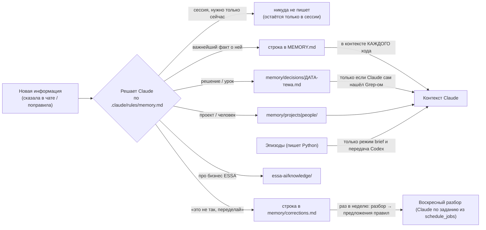

# JARVIS — архитектурный аудит по реальному коду

Дата: 2026-10-06. Код при аудите **не менялся**: только чтение и один безопасный прогон чистой функции Guard
(`decide()`, без записи) и чтение `state/events.jsonl` для проверки утверждений.

**Как читать пометки.** Всё, что ниже стоит без пометки, подтверждено кодом (файл и строка указаны).
`[не подтверждено]` — в коде проекта этого нет или проверить без запуска нельзя; это гипотеза, а не факт.
`[расхождение]` — документация говорит одно, код делает другое.

Что я НЕ делал: не запускал `pytest` (боевой бот сейчас работает, а тесты могут писать в `state/`), не запускал
бота и Claude/Codex, не проверял поведение библиотек Telegram и Claude Code по их исходникам — только то, что видно
в этом репозитории и в `state/`.

---

## A. JARVIS за 1 минуту

JARVIS — это **маленькая Python-программа-вахтёр** вокруг **настоящего Claude Code** (а сейчас — иногда и Codex).

1. Ты пишешь в Telegram. Python-программа (бот, окно `start.bat`) проверяет, что это ты, и кладёт сообщение в очередь.
2. Когда доходит очередь, Python запускает отдельный процесс `claude -p` (Claude Code по твоей подписке) и отдаёт ему
   текст. **Всё «думание» — внутри Claude.** Python не решает, что делать с твоей просьбой.
3. Claude сам читает файлы, ищет, пишет, запускает навыки и помощников. Но **каждый его шаг** сначала проходит через
   «охранника» (Guard): читать можно почти всё, а отправить / удалить / записать в важное — только после твоей кнопки
   «Подтвердить» в Telegram.
4. Когда Claude закончил, Python берёт его ответ, при необходимости просит «второго Claude» перепроверить, пишет строку
   в журнал и присылает ответ тебе.
5. «Память» — это обычные текстовые файлы в папке проекта. Claude читает их, когда они нужны, и пишет туда сам
   (по правилам из `CLAUDE.md`). Python пишет только короткие «эпизоды» (итог каждой задачи).
6. Утреннее сообщение, радар и еженедельный разбор поправок запускает сам бот по расписанию.

Проще говоря: **Python = дверь, очередь, охранник, журнал. Claude = мозг и руки. Файлы = память.**

Важный факт на сегодня: по `state/runtime.json` твой чат сейчас переключён на **Codex** без срока возврата
(`"until": null`), и все 14 последних задач в журнале выполнил Codex, а не Claude. Назад — командой `/claude`.

---

## B. Архитектурная схема

```mermaid
flowchart TD
    TG["Telegram (только владелица)"] -->|апдейт| GW

    subgraph PY["Детерминированный Python-процесс (start.bat → python -m integrations.telegram)"]
        GW["Gateway<br/>integrations/telegram/gateway.py<br/>allow-list, команды, кнопки, отправка"]
        SCHED["Расписание<br/>runtime/schedule.py + schedule_jobs.py<br/>опрос раз в 10 с"]
        ROUTER["TaskRouter<br/>runtime/task_router.py<br/>очередь, бюджет, таймаут, проверка"]
        WORKER["worker.py<br/>Claude или Codex, лимиты"]
        BR_C["claude_bridge.py<br/>запуск claude -p, разбор потока"]
        BR_X["codex_bridge.py<br/>запуск codex exec"]
        APPR["Approvals API<br/>runtime/approvals.py<br/>127.0.0.1, токен"]
        EV["events.py + task_state.py<br/>state/events.jsonl"]
        SESS["sessions.py<br/>state/sessions.json"]
    end

    GW --> ROUTER
    SCHED --> ROUTER
    ROUTER --> WORKER
    ROUTER --> BR_C
    ROUTER --> BR_X
    ROUTER --> EV
    ROUTER --> SESS

    subgraph AI["Claude Code (отдельный процесс на каждый ход) — решает сам"]
        CLAUDE["claude -p<br/>CLAUDE.md + SOUL/GOALS/MEMORY + jarvis-turn.md"]
        TOOLS["Инструменты: Read/Write/Edit/Bash/PowerShell/WebFetch/…"]
        MCP["MCP: Playwright (браузер)"]
        SKILLS["Навыки .claude/skills/*"]
        SUBS["Субагенты .claude/agents/*"]
    end

    BR_C -->|stdin: prompt| CLAUDE
    CLAUDE -->|stream-json| BR_C
    CLAUDE --> TOOLS
    CLAUDE --> MCP
    CLAUDE --> SKILLS
    CLAUDE --> SUBS

    GUARD["Guard-хук<br/>.claude/hooks/guard.py + runtime/policy.yaml<br/>(на КАЖДЫЙ вызов инструмента)"]
    TOOLS -. PreToolUse .-> GUARD
    MCP -. PreToolUse .-> GUARD
    SUBS -. PreToolUse .-> GUARD
    GUARD -->|нужна кнопка| APPR
    APPR -->|кнопки| GW
    GW -->|Подтвердить / Отклонить| APPR

    BR_X -->|codex exec| CODEX["Codex (запасной исполнитель)"]
    CODEX -. хук .codex/hooks.json .-> GUARD

    subgraph FILES["Файловая память и состояние"]
        MEM["MEMORY.md, memory/*, essa-ai/*"]
        EPI["memory/episodes/*.jsonl"]
        ST["state/*.json (очередь не хранится!)"]
    end
    CLAUDE <-->|читает / пишет сам| MEM
    ROUTER -->|пишет эпизод| EPI
    ROUTER --> ST
    TOOLS -->|вызов интеграций| INTEG["integrations/visuals, montage, radar, content_plan<br/>(обычный Python-код)"]

    ROUTER -->|результат| GW
    GW -->|ответ, файлы| TG
```

---

## C. Путь одного Telegram-запроса (по коду, а не по ожиданию)

Обычное текстовое сообщение. Ожидаемая схема «Telegram → очередь → TaskRouter → Claude Bridge → Claude Code → Telegram»
**верна по сути**, но с важными уточнениями (они выделены ⚠).

| № | Что происходит | Файл : функция |
|---|---|---|
| 1 | **Появление.** Бот работает в режиме long polling (`app.run_polling`). Текст приходит как апдейт. ⚠ Включено `concurrent_updates(True)`: апдейты обрабатываются параллельно, а не по одному. | `gateway.py:982`, `run()`; обработчик `Gateway.on_message` `:320` |
| 2 | **Кто пишет.** Проверка `effective_user.id == TELEGRAM_OWNER_ID` (пустой ID = «режим настройки», отвечает только на `/whoami`). Чужие апдейты молча игнорируются. «Чат» = `effective_chat.id` (у личного чата совпадает с ID владелицы). | `Gateway._allowed` `:177` |
| 2а | ⚠ **Короткий путь без Claude.** Если текст ≤ 60 символов и похож на «что на сегодня» (регулярка), Python отвечает сам утренней сводкой, Claude не запускается и лимит не тратится. | `gateway.py:132` `_TODAY_QUESTION`, `:379` |
| 3 | **Создание задачи.** Создаётся `Job(prompt, task=первые 40 символов, uses_browser=False, on_event, runtime)`. `task_id` — случайные 12 hex-символов. | `Gateway._run` `:377`, `Job` `task_router.py:62` |
| 4 | **Постановка в очередь.** `router.submit(chat_id, job)` кладёт `Job` в `deque` этого чата, пишет события `task_state=queued` и `user_message`, будит рабочую корутину чата. Если впереди кто-то есть — владелице уходит «Секунду, я ещё занят…». | `TaskRouter.submit` `:183` |
| 5 | **Начало выполнения.** Рабочая корутина `_worker` берёт задачу из начала очереди. Далее `_run` → `_run_turn`. | `_worker` `:263`, `_run_turn` `:287` |
| 5а | **Проверки перед запуском:** дневной бюджет (`_take_budget`, по умолчанию 100 запусков в сутки); выбор исполнителя (Claude/Codex); для Codex — проверка, что Guard в нём жив; снимок `git status` «до». Событие `task_state=running`. | `:288–326` |
| 6 | **Prompt / контекст.** Текст = сообщение владелицы. К нему Python добавляет сводку, только если: чат молчал ≥ 8 ч (режим `brief`: 3 последних эпизода + ждущий план), или вернулись с Codex на Claude, или идёт первая задача в Codex. Если есть сохранённый план — он прикрепляется к ходу (`job.spec`). Системный контекст Claude собирает сам Claude Code из `CLAUDE.md` (с `@SOUL.md @GOALS.md @MEMORY.md`) + `runtime/jarvis-turn.md` + список имён навыков. | `_run_turn` `:297–316`, `claude_bridge.build_args` `:101` |
| 7 | **Запуск Claude Code.** Отдельный процесс `claude -p --output-format stream-json --verbose [--resume <session>] --permission-mode dontAsk --append-system-prompt-file runtime/jarvis-turn.md --settings runtime/jarvis-settings.json --max-turns 60 --setting-sources project --disable-slash-commands --model sonnet`. Prompt уходит через stdin. Окружение очищено от `CLAUDE*/ANTHROPIC*/TELEGRAM*`. Рабочая папка — корень проекта. В окружение ставится `JARVIS_TASK_ID`. | `claude_bridge._run_once` `:222`, `run_turn` `:386`, `build_env` `:88` |
| 8 | **Доступ к tools / MCP / skills / subagents.** Определяется файлами, которые Claude Code подхватывает сам: `runtime/jarvis-settings.json` (allow-список инструментов, Guard-хук), `.mcp.json` (Playwright), `.claude/skills/` (имена навыков передаёт Python строкой в system prompt, описание Claude читает из файла), `.claude/agents/` (6 ролей). Python **не решает**, какой инструмент вызвать. | `jarvis-settings.json`, `.mcp.json`, `build_args` `:112–116` |
| 9 | **Получение результата.** Python читает stdout построчно как JSON-события, ведёт счётчики (вызовы инструментов, затронутые файлы), пишет события в журнал, финальное событие `result` превращает в `TurnResult(status = ok / stopped / rate_limited / auth_required / error)`. | `_run_once`, `_absorb` `:279`, `_to_result` `:352` |
| 9а | **Таймаут и расширения.** Ход ограничен 45 минутами (`asyncio.wait(timeout)`); по истечении — остановка дерева процесса, статус `timeout`. Потом: `git status` «после» → список изменённых файлов; если был план / комплект / код — запускается **независимая проверка** отдельным `claude -p` (только чтение, до 2 кругов, при `fix` — исправление, при изменении кода — ещё и `pytest`). | `_timed` `:361`, `_review` `:386`, `review.needs_review` `review.py` |
| 10 | **Возврат пользователю.** Результат попадает в `job.result`; обработчик, ждавший `await job.result`, формирует ответ: markdown → HTML-куски (`render.prepare`), слишком длинное — файлом `answer-….md`, строки `📎 путь` — как вложения, при лимите Claude — кнопки «Продолжить в Codex / Подождать». | `Gateway._deliver_inner` `:485` |
| 11 | **После завершения.** `_record`: событие `task_state` (финальное), `task_done` (статус, длительность, вызовы, файлы, попытки, вердикт проверки), и — если ход реально работал — строка эпизода в `memory/episodes/ГГГГ-ММ.jsonl` (текст запроса и ответа режутся до 500 символов и проходят маскировку секретов). Сессия Claude сохраняется в `state/sessions.json`. Рабочая корутина берёт следующую задачу. | `_record` `:476`, `_write_episode` `:496`, `sessions.set` `:338` |

Поправка к схеме: слова «Claude Bridge → Claude Code» верны, но между ними **нет модели «роутера задач»,
которая выбирает исполнителя по смыслу**. Исполнителя выбирает только флаг в `state/runtime.json` (Claude/Codex), а что
делать с задачей — решает уже сам Claude внутри хода.

---

## D. Таблица компонентов

Показаны только архитектурно значимые. Файлы — от корня проекта.

| Компонент | Зачем | Вход | Выход | Файл |
|---|---|---|---|---|
| **Запуск** (`start.bat`; автозапуск — `scripts/install_autostart.ps1`) | поднять бота | — | процесс Python в консольном окне | `start.bat`, `integrations/telegram/__main__.py` |
| **Gateway** | единственный интерфейс владелицы: апдейты, allow-list, команды, кнопки, отправка, фоновый цикл | апдейты Telegram | `Job` для роутера; сообщения и файлы в Telegram | `integrations/telegram/gateway.py` |
| **Расписание** | запуск задач по времени, догон пропущенного | `runtime/schedule.json`, `state/schedule.json` | `Job` (isolated) или письмо в `state/outbox/` | `runtime/schedule.py`, `runtime/schedule_jobs.py` |
| **TaskRouter** | очередь, один ход на очередь, бюджет, таймаут, git-diff, проверка, эпизоды | `Job` | `TurnResult` | `runtime/task_router.py` |
| **claude_bridge** | запустить `claude -p`, разобрать поток, остановить дерево процесса, повтор без `--resume` | prompt, session_id | `TurnResult` + события в журнал | `runtime/claude_bridge.py` |
| **codex_bridge + worker** | запасной исполнитель при лимите Claude; хранение «кто работает» и лимитов | prompt | `TurnResult` | `runtime/codex_bridge.py`, `runtime/worker.py` |
| **Guard** | проверка каждого вызова инструмента по таблице | JSON хука (имя инструмента, аргументы) | allow / deny / «спросить» | `.claude/hooks/guard.py`, `runtime/policy.yaml` |
| **Approvals API** | локальный HTTP-сервис: Guard спрашивает → кнопки в Telegram → ответ | POST `/approve` с токеном | `allow` / `deny` | `runtime/approvals.py` |
| **Настройки хода** | что Claude разрешено, какие хуки, какой системный промпт | — | параметры `claude -p` | `runtime/jarvis-settings.json`, `reviewer-settings.json`, `jarvis-turn.md`, `no-mcp.json` |
| **Независимая проверка** | второй Claude только с чтением оценивает результат (`pass/fix/fail`) | запрос, план, файлы, ответ, хвост тестов | вердикт | `runtime/review.py`, `runtime/prompts/review.md` |
| **Планы (spec)** | запомнить план «Сделаю/Готово, когда/Не делаю», приложить к следующему ходу | текст ответа | `state/specs/<chat>.json` | `runtime/spec.py` |
| **Сессии** | какой `session_id` Claude у чата; когда чат писал последний раз | — | `state/sessions.json`, `state/session_activity.json` | `runtime/sessions.py` |
| **Журнал и состояния** | единый журнал событий; снимок «что делаю» | события | `state/events.jsonl`; текст для `/status` | `runtime/events.py`, `runtime/task_state.py` |
| **Маскировка** | вырезать секреты из журналов | текст | текст со `***` | `runtime/redact.py` |
| **Активация черновиков** | перенос `drafts/` → `.claude/skills|agents` только по кнопке | имя черновика | включённый навык / помощник | `runtime/activation.py` |
| **Хуки памяти** | напоминания Claude («запомни», «сохрани урок»), эпизод при сжатии, проверка размера `MEMORY.md` | JSON хука | подсказка в контекст / строка эпизода | `.claude/hooks/memory_notice.py`, `capture_learning.py`, `pre_compact.py`, `session_start.py` |
| **Навыки** (24 шт. в `.claude/skills/`) | «как делать» повторяемые задачи (текст описывает порядок для Claude) | — | инструкции для Claude | `.claude/skills/*/SKILL.md` |
| **Субагенты** (6 ролей) | узкие помощники с урезанными инструментами | — | ответ главному Claude | `.claude/agents/*.md` |
| **Интеграции** | обычный Python-код, который Claude запускает командой (карусели, монтаж, радар, контент-план) | аргументы командной строки | файлы | `integrations/visuals`, `montage`, `radar`, `content_plan` |
| **Файловая память** | факты, решения, поправки, знания ESSA.AI | — | текст, читаемый Claude | `MEMORY.md`, `memory/`, `essa-ai/` |

---

## E. Где код, а где AI

### Детерминированный код (Python, конфиги — решение заранее прописано)

- Пускать ли апдейт (только владелица) — `_allowed`.
- Что такое «чат» и «задача»; порядок задач (FIFO); одна активная задача на очередь.
- Какой исполнитель (Claude/Codex) — по `state/runtime.json`, по кнопке владелицы или при лимите.
- Бюджет запусков, таймаут, повтор без `--resume`, новая сессия при переполнении контекста.
- Нужна ли независимая проверка (`needs_review`: был план, или файлы в `essa-ai/content/`, или менялся код).
- Что разрешено сделать инструменту (Guard + `policy.yaml`) — чистая функция `decide()`.
- Когда бот будит расписание, что присылает утром (`schedule_jobs.morning`), как запускается радар (`radar`).
- Как выглядит ответ в Telegram, когда он «файлом».
- Как выглядят карусели, монтаж, радар — интеграции целиком детерминированные.

### AI (Claude / Codex решает сам внутри хода)

- Что вообще означает просьба и в каком порядке действовать.
- Какой инструмент вызвать (Read / Grep / Bash / Playwright / …) и сколько раз.
- Читать ли файл и какой; менять ли файл (в рамках того, что пропустит Guard).
- Какой навык открыть (Python даёт только список имён).
- Вызвать ли субагента и какого (инструмент `Agent`/`Task`).
- Работать ли с браузером (MCP Playwright подгружен в каждый обычный ход — см. ниже).
- Что запомнить, куда записать (`MEMORY.md` / `memory/decisions/` / …) и как это сформулировать.
- Оформить ли ответ как «план» и ждать «да» (правило в `jarvis-turn.md`) — а Python потом **узнаёт** план по заголовкам.
- Когда задача «закончена»: Claude сам решает, что ответил полностью.

### Кто принимает решение — по пунктам

| Вопрос | Кто решает | Граница |
|---|---|---|
| Какую задачу выполнять | **Владелица** (каждое сообщение — задача) + **код** (расписание, `/today`) | Код сам создаёт задачи по расписанию; смысл задачи толкует Claude |
| Какой tool использовать | **Claude** | Guard может запретить или потребовать кнопку; выбрать вместо Claude не может |
| Нужен ли MCP | **Claude** | Какие MCP вообще доступны — решает код (`.mcp.json`, `no-mcp.json`); в обычном ходе Playwright подключён всегда, в фоновых (расписание) и в проверке — нет |
| Нужен ли subagent | **Claude** | Какие роли существуют и какие у них права — файлы и `policy.yaml` |
| Работать ли с браузером | **Claude** | Guard: клик по «оплатить/купить» — отказ; «отправить/опубликовать» — кнопка; поля пароля/карты — отказ. Но обычный клик/ввод по умолчанию = READ (см. G) |
| Читать / изменять файлы | **Claude + Guard** | Внутри папки проекта запись автоматически разрешена; исключения — защищённые и «правила JARVIS» (см. G) |
| Какую память использовать | **Claude** (грепает, читает) + **код** (подмешивает сводку при `brief` и при смене исполнителя) | Автоматически в контекст попадает только то, что подключено `@`-импортами `CLAUDE.md` |
| Когда задача готова | **Claude** (его ответ = итог) + **код** (статус `ok` = «процесс завершился успешно», не «задача выполнена») + **второй Claude** при существенных задачах | Единственная независимая проверка «по сути» — `review`, и она срабатывает не всегда |

Принцип одной строкой: **код решает «можно ли и в каких рамках», Claude решает «что и как».**

---

## F. Memory map

Девять разных вещей, которые легко принять за «память». Они **не** одно и то же.

| Механизм | Что хранится | Где | Кто пишет | Кто читает | Попадает в контекст автоматически? | После перезапуска |
|---|---|---|---|---|---|---|
| **Claude-сессия** | вся переписка хода с инструментами (внутри Claude Code) | файлы Claude Code на диске (`~/.claude/…`) `[расположение не проверялось]`; `session_id` — в `state/sessions.json` | Claude Code | Claude Code при `--resume <id>` | Да, при `--resume` | Сохраняется (id в файле) |
| **Контекст текущего запроса** | prompt + системный контекст хода | в памяти процесса `claude` | мост + Claude Code | Claude | — | Живёт только ход |
| **История Telegram-чата** | **нигде не хранится ботом.** В журнале — лишь название задачи (40 символов), ответы ≤ 500 символов | — | — | — | Нет | Нет такого механизма |
| **Краткосрочное состояние** | планы (`state/specs/`), предложения Codex (`state/offers/`), кто работает (`state/runtime.json`), отложенное (`state/deferred.json`), бюджет (`state/run_budget.json`), слоты расписания (`state/schedule.json`), время последнего хода (`state/session_activity.json`) | `state/*.json` | Python | Python | Нет (кроме плана, который мост сам прикладывает к ходу) | Сохраняется. **Очередь задач не хранится** — см. I |
| **Долговременная память — `MEMORY.md`** | 10 фактов (4 КБ; лимит 5 КБ) | `MEMORY.md` | Claude (по правилу) или человек | Claude | **Да, каждый ход** (`@MEMORY.md` в `CLAUDE.md`) | Сохраняется |
| **Долговременная память — `memory/`** | `decisions/`, `projects/`, `people/` (пусто), `corrections.md` | `memory/` | Claude | Claude, только если сам откроет / найдёт | Нет | Сохраняется |
| **Эпизоды** | итог каждого хода: дата, запрос, результат, файлы, статус, исполнитель | `memory/episodes/ГГГГ-ММ.jsonl` | **Python** (`_write_episode`) и **хук PreCompact** (другая схема, при сжатии контекста) | Python — только для режима `brief` и передачи Codex (3–5 последних) | Только в `brief` / при смене исполнителя | Сохраняется |
| **Знания ESSA.AI** | профиль, аудитория, голос, продукты… | `essa-ai/` (много файлов) | человек, иногда Claude | Claude через `essa-ai/INDEX.md` по запросу | Нет | Сохраняется |
| **Журнал событий** | события хода: задачи, вызовы инструментов, блокировки, ошибки | `state/events.jsonl` (ротация 10 МБ) | Python, Guard, Approvals | Python для `/status`; человек | Нет. Это **журнал, не память** | Сохраняется |
| **Векторная память / база данных** | **их нет** | — | — | — | — | — |

Есть и девятая вещь, которую код не создаёт: автопамять самого Claude Code (папка `~/.claude/projects/<проект>/memory/`,
у тебя там есть файлы). Читает ли её **бот-ход** с флагом `--setting-sources project`, по коду проекта не определить
`[не подтверждено]`.

### Поток: новая информация → сохранить? → где → как достать



Что важно: **решение «сохранять ли» принимает Claude, а не код.** Код гарантирует только эпизоды (итог каждого хода) и
напоминания: хук `capture_learning` после ≥ 3 вызовов инструментов просит «подумай, не сохранить ли урок», хук
`memory_notice` после записи в память просит добавить «🧠 запомнил». Работает ли эта подсказка хука `Stop` в режиме
`-p` — по коду проекта подтвердить нельзя, есть только тест формата вывода `[не подтверждено]`.

### Сценарий «Раньше использовали Open Sans. Теперь используем другой шрифт»

1. **Где должна лежать актуальная информация.** По правилам — одна строка в `MEMORY.md` (если это важнейший факт) и/или
   запись в `memory/decisions/`. Но «правила шрифтов» сегодня живут **в нескольких местах**: `essa-ai/CAROUSEL_ASSETS.md`,
   `essa-ai/archive/ESSA_PROJECT_KNOWLEDGE_PACK.md`, навык `carousel-instagram/SKILL.md` и его `references/legacy-build.md`,
   `memory/corrections.md` (там рядом стоят «Inter/Manrope/Golos» для лид-магнита и «Oswald + Open Sans» для обложек),
   зеркала в `.agents/skills/…`.
2. **Как старое перестаёт влиять.** **Никак автоматически.** Нет ни признака «устарело», ни срока годности, ни ссылки
   «заменено записью N». Старое перестаёт действовать, только если Claude (или ты) **вручную найдёт и поправит каждое место**.
   Правило `memory.md` говорит «проверь Grep, нет ли уже такого факта — обнови, а не дублируй», но это инструкция модели,
   не механизм: проверить, что поправлены все копии, код не может.
3. **Механизм разрешения конфликтов воспоминаний — его нет.** Ближайшее: еженедельный разбор поправок просит Claude
   «сгруппировать, что **противоречит уже записанным правилам**» (`runtime/prompts/corrections-review.md`). Это попытка
   обнаружить конфликт моделью раз в неделю, а не защита в момент записи.
4. Дополнительно: `essa-ai/` и навыки лежат и в зеркалах для Codex (`.agents/skills/` — 27 различий с `.claude/skills/`
   по `diff -rq`; намеренные ли они, я не проверял), то есть **у одного правила может быть до трёх копий**.
5. И ещё факт: в `memory/corrections.md` **ни одна строка не отмечена «разобрано»** (проверено поиском), хотя слот
   еженедельного разбора в `state/schedule.json` прошёл 2026-10-04. То есть цикл «поправка → правило» по факту
   ни разу не был доведён до записанного правила.

---

## G. Permissions map

Проверяет **один** слой — Guard (`PreToolUse`-хук на каждый инструмент, включая `mcp__*` и субагентов), fail-closed:
любая ошибка хука = отказ. Уровни: READ / WRITE / EXTERNAL / MONEY / DENY. Побеждает самый строгий.
Режим Claude: `--permission-mode dontAsk` + явный allow-список (`jarvis-settings.json`); `bypassPermissions` нигде нет.

Ниже — не «как задумано», а **как `decide()` отвечает на конкретные вызовы** (я прогнал их через настоящую функцию):

### Что разрешено автоматически (без кнопки)

| Действие | Результат Guard | Комментарий |
|---|---|---|
| Read / Glob / Grep / WebFetch / WebSearch | READ → разрешено | Чтение файла > 100 КБ целиком — кнопка (`big_read`) |
| Запись **внутри папки проекта** (кроме защищённых и «правил») | WRITE → разрешено | Сюда входят `memory/`, `MEMORY.md`, `essa-ai/`, `drafts/`, **а также `state/`** (см. ниже) |
| Bash / PowerShell: обычные команды | WRITE → разрешено | Включая `git add`, `git commit`, `pip install`, `npm install`, `curl <url>` (GET) |
| `python -m integrations.*`, `python -m pytest` | разрешено без вопроса | Все модули `integrations/` — «доверенные» |
| Playwright: navigate / click / type / fill / select / press_key и др. | **READ → разрешено**, пока текст аргументов не совпал с ключевыми словами | `click` на «Button» (без слова) — разрешено; `click` на «Опубликовать» — кнопка |
| Вызов субагента (`Agent`/`Task`), `Skill`, `TodoWrite` | READ → разрешено | У ролей из `policy.agents` свои ограничения записи; `general-purpose` в списке нет — права главного |

### Что требует кнопки «Подтвердить»

| Действие | Вид |
|---|---|
| `git push`, `gh pr/issue/release … create/comment/…` | EXTERNAL `publish` |
| `curl -X POST/PUT/…`, `Invoke-WebRequest -Method Post` | EXTERNAL `network_write` |
| Запись вне папки проекта | EXTERNAL `write_outside_root` |
| Правка `CLAUDE.md`, `SOUL.md`, `GOALS.md`, `AGENTS.md`, `.claude/rules/**`, `.agents/**`, `.codex/**` | EXTERNAL `self_modify` (на кнопке — путь и начало правки) |
| `python -c`, `node -e`, свой скрипт, запуск вне доверенных мест | EXTERNAL `run_script` |
| Любое удаление (`rm`, `Remove-Item`, `del`, `os.remove`, `shutil.rmtree`, `git clean`…) | MONEY `delete` |
| Бронь; «удалить/отменить» в браузере | MONEY |
| Клик/Enter на «отправить/опубликовать/поделиться/ответить», регистрация, загрузка файла на сайт, `browser_evaluate` | EXTERNAL |
| Незнакомый инструмент или MCP | EXTERNAL `unknown_tool` |
| Адрес с «данными» (длинные параметры, токеноподобные куски) в WebFetch/navigate | EXTERNAL `url_data` |

### Что запрещено совсем (DENY, кнопки нет)

Чтение/упоминание секретов (`.env*`, `credentials*`, `state/secrets/**`, `~/.ssh`, профиль браузера); запись в
`runtime/**`, `integrations/**`, `.claude/hooks|skills|agents|settings*`, `.mcp.json`, `.codex/hooks.json`;
оплата/покупка в браузере; ввод в поля пароля/карты; `git push --force`, форматирование диска, реестр, `schtasks`,
`Set-ExecutionPolicy`, скачивание и запуск exe, `icacls`/`takeown` и подобное.

### Ответ на твой принцип «read ≠ write ≠ execute ≠ external side effect»

В Guard эти четыре понятия различаются **только отчасти**:

| Принцип | Как реализовано | Проблема |
|---|---|---|
| read | отдельный уровень READ | Но «браузерный клик» и «ввод текста» тоже отнесены к READ (см. ниже) |
| write | отдельный уровень WRITE; защита `runtime/`, `integrations/`, хуков | Разрешена вся папка проекта, в т. ч. `state/` |
| execute | `python -c`, `node`, свои скрипты → кнопка; `-m integrations.*` — без вопроса | Любая команда Bash/PowerShell, не совпавшая с шаблоном, = обычный WRITE |
| external side effect | `git push`, POST, браузерные «отправить» — кнопка; **но** `message_owner: auto` и интеграции выходят в сеть без вопроса | Решение принимается по **тексту команды и подписи кнопки**, а не по реальному эффекту |

### Что опаснее, чем ты, вероятно, думаешь (подтверждено прогоном `decide()`)

1. **`state/` не защищена от записи Claude.** Claude может записать (WRITE, без кнопки): `state/run_budget.json`
   (обнулить дневной лимит), `state/runtime.json` (переключить Claude/Codex), `state/events.jsonl` (подправить журнал),
   `state/outbox/*.md` (положить письмо — бот сам доставит его тебе в Telegram), `state/specs/`, `state/deferred.json`.
   Секреты в `state/secrets/` защищены отдельно (DENY).
2. **Браузер: клики и ввод разрешены по умолчанию** (READ). Guard видит только JSON вызова — подпись элемента, которую
   сам Claude дал кнопке (`"element": "…"`). Если подпись не содержит ключевых слов (`отправить`, `send`, `publish` …), клик
   пройдёт без вопроса. Сайт, где ты залогинена в профиле `state/browser-profile`, остаётся доступным. Ключевые слова — русский и английский.
3. **`git commit`, `git add`, `pip install`, `npm install` — без вопроса** (`pip install` ставит код из интернета и может исполнить его).
4. **Все модули `integrations.*` считаются доверенными** и запускаются без вопроса с любыми аргументами. Они сами ходят
   в сеть и тратят платные квоты (Apify — радар, KIE/imagegen — картинки, Groq — расшифровка): там есть собственные лимиты
   (`integrations/radar/budget.py`), но Guard их не видит как «деньги».
5. **Защита основана на разборе текста регулярками**, а не на песочнице. Агент, пытающийся обойти её, упирается в
   «команда упоминает защищённый путь + запись/интерпретатор» и в «любой `python -c` = кнопка», но абсолютной гарантии
   от обхода нет `[теоретический риск, обход на практике не воспроизводил]`.
6. **Хук проверяет «до», кнопка одноразовая.** Если ты нажала «Подтвердить» на «запиши в файл X» — выполнится то,
   что было в запросе. Это хорошо; но на кнопке видны первые 300 символов, длинные команды обрезаны.

Дополнительно, **в обычном ходе работают два Guard-хука одновременно**: `.claude/settings.json` (режим `dev`, проектный,
подхватывается из-за `--setting-sources project`) и `runtime/jarvis-settings.json` (режим `jarvis`). Итог — строже из двух;
лишний процесс на каждый вызов инструмента.

Из чего следует: «LOW RISK — сама, HIGH RISK — спрашивает» в основе так и работает, но **граница проходит по тексту команд,
а не по реальным последствиям**, и несколько важных мест (`state/`, клики в браузере, `git commit`, `pip install`, модули
интеграций) находятся на «автоматической» стороне.

---

## H. Failure map — где ломается и как это обнаруживается

### Очередь и параллельность — подтверждено / опровергнуто

| Утверждение | Результат | Откуда |
|---|---|---|
| FIFO для одного чата | **Подтверждено.** `deque`, `popleft` | `submit`, `_worker` |
| Одна активная задача на чат | **Подтверждено.** Один `_worker` на ключ очереди | `_workers[qkey]` |
| 2–5 сообщений подряд | Каждое — отдельная задача, выполняются **по очереди, по одной**; каждое тратит запуск бюджета и получает свой ответ. **Склейки нет.** Владелица получает «Секунду, я ещё занят…». ⚠ Из-за `concurrent_updates=True` порядок постановки — это порядок завершения обработчиков; текст попадёт в очередь раньше голосового, если голосовое ещё распознаётся | `gateway.py:982, 399` |
| Разные чаты одновременно | Чаты независимы, но **разрешён один владелец**, то есть реально «два рельса»: чат и фон (`queue="schedule"`) идут **параллельно** | `submit :187` |
| Ограничения для браузера | Есть глобальный замок `_browser_lock`, но ⚠ **`uses_browser` всегда `False`** во всех местах создания задач, поэтому замок **никогда не берётся**. Фоновые ходы и проверка запускаются без Playwright (`browser=False`), поэтому одновременного доступа к профилю браузера нет **по другой причине** | `gateway.py:397, 477, 707, 729`; `[расхождение с ARCHITECTURE.md §3: «одна браузерная задача глобально»]` |
| Timeout | **45 минут** на запуск (`JARVIS_TASK_TIMEOUT_SEC`), у расписания — своё `timeout_min`. Считается **отдельно на каждый запуск**: ход, проверка, исправление, повторная проверка — каждый до 45 мин. `pytest` (до 15 мин) в таймаут **не входит** | `_timed :361`, `run_tests :130` |
| Дневной бюджет | 100 запусков в сутки (`JARVIS_DAILY_RUN_BUDGET`); считает запуски, **не деньги и не токены**. Неуспешный ход (`error/rate_limited/auth_required`) возвращает единицу, `timeout` — нет. Проверка и исправление тоже тратят | `_take_budget :528`, `_refund_budget :509` |
| Retry | **Узкий.** Только в мосту: сломанный `--resume` без вызовов инструментов → один повтор без него; переполнение контекста → один повтор в новой сессии. Если ход уже вызывал инструменты — **сам не повторяется** (чтобы не повторить внешнее действие). Rate limit → не повторяет, предлагает Codex/«подождать» | `claude_bridge.run_turn :386–430` |
| После ошибки | Задача завершается статусом `failed`, владелица получает текст, очередь идёт дальше. Неожиданное исключение в роутере → «Ой, у меня что-то сломалось…», очередь идёт дальше | `_worker :270–273` |
| После timeout | Дерево процесса убивается, статус `timeout`, текст «часть действий могла уже выполниться», очередь идёт дальше | `_timed :370–383` |
| Зависшая задача блокирует следующие? | **Дольше 45 минут — нет** (таймаут). Теоретический обход таймаута: после `stop` код делает `await turn`; если убийство дерева процессов не удалось (`taskkill` упал по таймауту или ошибке), а дочерние процессы держат канал, `await` может не вернуться `[теория, не воспроизведено; по журналу аудита 2026-10-05 тест остановки дерева процессов падал на этой машине]` | `claude_bridge.stop :439`, `_timed :373–374` |
| Можно ли остановить текущую задачу | **Да, `/stop`**, но только активный запуск (Claude или Codex). Очередь не очищается — следующая задача **стартует сразу**. Если в этот момент идёт не `claude`, а `pytest` после хода или смена очереди, `/stop` отвечает «ничем не занят», хотя чат занят | `TaskRouter.stop :207`, `cmd_stop` |
| Продолжит ли очередь работу | **Да** | `_worker` — цикл `while q` |

### Потенциальные гонки и места потери задач (реально существующие)

1. **Потеря очереди при перезапуске.** Очередь — `deque` в памяти. Не сохраняется. Сообщения, стоявшие в очереди, и
   выполнявшаяся задача исчезают без следа и без уведомления.
2. **Задача расписания «сгорает».** Слот отмечается выполненным **до** запуска (`check_schedule :696`). Падение между
   отметкой и результатом = утреннее/радар/разбор пропущено без догона.
3. **Отложенные задачи («Подождать») удаляются из файла до запуска** (`worker.due_deferred`): падение между «забрал»
   и «запустил» теряет задачу.
4. **Зависшее состояние «работает».** Подтверждено на твоих данных: в `state/events.jsonl` четыре задачи навсегда
   в `running`/`review` (`1bfdeea65d67`, `6e1b59d1aba6`, `023f0d3b5cff`, `349d0dd0e268`), и `/status` **сейчас** выдаёт
   «▶️ Сейчас занят: «сделай контент на сегодня…» — работаю (4 ч 31 мин)», хотя бот свободен. Тот же устаревший
   снимок используется в тексте «я ещё занят задачей «…»», так что он может назвать не ту задачу.
5. **Синхронное распознавание голосового блокирует весь бот.** `voice.transcribe(...)` вызывается прямо из
   асинхронного обработчика без `to_thread` (`gateway.py:335`). Пока Whisper работает (а первый раз ещё и загружает модель),
   замирают всё: `/stop`, кнопки «Подтвердить», расписание, «печатает…».
6. **Атрибуция файлов при двух рельсах.** «Файлы хода» = разность `git status` до/после. Если параллельно идёт фоновая
   задача, её изменения могут попасть в список файлов чат-задачи и в проверку.
7. **Два параллельных рельса пишут один бюджет** — это безопасно (один поток событий asyncio, без `await` между чтением
   и записью), отдельной гонки нет.
8. **Лимит Claude → ожидание.** Предложение Codex хранится в `state/offers/` до нажатия кнопки; если кнопку не нажать,
   оно просто остаётся (устаревание — только на кнопке, не по времени).

Взаимных блокировок (deadlock) по коду я не нашёл, кроме теоретического пункта про `await turn` выше.

### Что и как обнаруживается

| Сбой | Где перехватывается | Куда пишется | Что узнаёт владелица | Что с очередью |
|---|---|---|---|---|
| Исключение внутри роутера | `_worker` `try/except` | `task_done` с `error=repr(exc)[:500]` (стека нет) | «Ой, у меня что-то сломалось внутри…» | идёт дальше |
| Ошибка Claude (`is_error`, `error_*`) | `claude_bridge._to_result` | `result`, `task_done`; `error` ≤ 1000 символов | «⚠️ Ход завершился со статусом error» + текст ответа | идёт дальше |
| Timeout | `_timed` | `error(subtype=timeout)`, `task_done` | «Остановился: я работал дольше N мин…» | идёт дальше |
| Лимит Claude | `_absorb` / `_to_result` | `error(subtype=rate_limit)`, `state/limits.json` | кнопки Codex / подождать | идёт дальше |
| Нужен повторный вход | `_AUTH_MARKERS` | `task_done` | «Claude просит войти заново…» | идёт дальше |
| Переполнение контекста / сломанный resume | `run_turn` | `error(context_overflow / resume_failed)` | «Не смог подхватить прошлый разговор…» | идёт дальше |
| Отказ Guard | `guard._log_blocked` | `blocked` в `events.jsonl` (причина маскируется) | Claude видит отказ и объясняет сам | — |
| Не доставился ответ в Telegram | `_deliver` | **только `log.warning` в консоль** | «Ответ у меня готов, но Telegram его не принял» (если и это отправилось) | идёт дальше |
| Падение процесса бота | **нигде** (процесс исчез) | — | Ничего — тишина | очередь потеряна |

### Если завтра Jarvis перестанет отвечать — смотри ПЕРВЫМИ (по порядку)

1. **Окно `start.bat`** — запущен ли процесс вообще; там же консольный лог Python (логи пишутся только в консоль;
   `state/boot.log` код проекта не создаёт — кто его пишет, я не нашёл).
2. **Последние строки `state/events.jsonl`** — есть ли `user_message` с твоим текстом, дошёл ли он до `task_state=running`,
   что в `task_done` (`result_status`, `error`).
3. **`state/runtime.json`** — не стоит ли чат на Codex без срока (сейчас стоит) и **`state/limits.json`** — не кончился ли лимит.
4. **`state/run_budget.json`** — не упёрся ли дневной лимит запусков (100).
5. **`state/approvals.port` и ждущая кнопка «Подтвердить»** — Claude мог «молча» ждать твоей кнопки до ~10 минут
   (Guard ждёт 590 с); а также `claude --version` / вход (`/login`) в терминале.

---

## I. Restart behavior

Сценарий: Jarvis выполняет задачу → процесс неожиданно завершается → запускается снова.

| Что | Результат |
|---|---|
| **Очередь** | **Потеряна полностью.** Все ждущие `Job` существовали только в памяти. Владелица не получает уведомления. |
| **Выполнявшаяся задача** | Дочерний `claude` — судьба неизвестна: он запущен как дочерний процесс; закроется ли он вместе с родителем, по коду не определить `[не подтверждено]`. Ответа владелица не получит. Если Claude успел записать файлы — они остаются. |
| **Сообщение в Telegram** | Было ли оно подтверждено Telegram-серверу как «получено» до падения, зависит от библиотеки `python-telegram-bot` `[не подтверждено: библиотека не изучалась]`; повторной постановки из `state/` нет. |
| **Claude-сессия** | `session_id` лежит в `state/sessions.json` и **сохраняется** — следующее сообщение продолжит ту же сессию (`--resume`), но оборванный ход в ней может быть неполным. Если `resume` не получится — код сам начнёт новую сессию и скажет об этом. После паузы ≥ 8 ч — новая сессия со сводкой. |
| **Memory** | Файлы целы. Эпизод оборванной задачи **не записан** (пишется в конце). |
| **Журнал** | Остаётся запись `task_state=running` без финала → «призрачная» задача в `/status` (подтверждено на 4 задачах). |
| **Approvals** | Ждущие кнопки гаснут; при остановке Approvals удаляет `approvals.port` и токен (при аварийном падении — **не** удаляет: см. `stop()`, он вызывается только при корректном завершении), Guard при недоступности API отказывает. Нажатие старой кнопки → «запрос устарел». |
| **Расписание** | Слот отмечен до запуска → оборванная задача расписания не догоняется. Неотмеченные — догоняются при первом опросе после старта. |
| **Кто работает (Claude/Codex)** | `state/runtime.json` сохраняется. |
| **Можно ли понять, что делалось перед падением** | **Частично.** `events.jsonl` содержит `user_message` → `task_state=running` → `tool_use` (с краткой сводкой, секреты замаскированы) → обрыв. Видно, на каком инструменте остановились. Причины падения (стека) нет, потому что Python-логи — только в консоли. |
| **Автозапуск** | `scripts/install_autostart.ps1` умеет зарегистрировать задачу Windows «стартовать при входе и перезапускать при падении». Зарегистрирована ли она у тебя — по коду проекта не определить `[не подтверждено]`. |

---

## J. Технический долг (только реально найденное)

Приоритет: 🔴 влияет на надёжность сейчас · 🟡 мешает понимать · 🟢 мелочь

🔴 **1. Очередь и текущая задача не переживают перезапуск**, никакого уведомления «я перезапустился, вот что потеряно».
🔴 **2. «Призрачные» задачи в `/status`**: состояние восстанавливается из хвоста журнала без учёта перезапусков (4 висящих задачи прямо сейчас).
🔴 **3. `state/` доступна для записи агентом**, включая бюджет, переключатель исполнителя и журнал событий. Защитная граница держит `runtime/`, но не «рабочие» файлы, на которые она опирается.
🔴 **4. Распознавание голоса блокирует весь event loop** (`gateway.py:335`).
🟡 **5. Мёртвая ветка кода:** `uses_browser` всегда `False`, глобальный браузерный замок не используется; документация утверждает обратное.
🟡 **6. Логи Python не пишутся в файл**, стек-трейсов нет (`repr(exc)[:500]`); у падения процесса нет следа вообще.
🟡 **7. Два источника правды для «что дальше после хода»:** эпизод пишут и мост, и хук `PreCompact` (разные схемы).
🟡 **8. Правила шрифтов и стиля лежат в 3–5 копиях** (essa-ai, навыки, зеркала Codex, corrections, archive); механизма «устарело / заменено» нет.
🟡 **9. Несколько настроек для одной цели:** `CLAUDE.md` (для бота) и `AGENTS.md` (для разработки + бот в Codex) + `.codex/` + `.agents/` + `runtime/jarvis-turn.md` — одно «поведение» собирается из пяти мест.
🟡 **10. Устаревшая документация:** `docs/ARCHITECTURE.md` (дизайн «ждёт подтверждения»), `docs/JARVIS_ARCHITECTURE_AUDIT.md` (2026-10-05: «проектного `.claude/settings.json` нет», «708 passed» — уже не так), `AGENTS.md` («512 passed»; в `tests/` сейчас 820 функций `def test_`).
🟡 **11. Цикл «поправка → правило» не замкнут:** ни одной отметки «разобрано» в `memory/corrections.md`.
🟡 **12. `GOALS.md` — сплошные `[ЗАПОЛНИ: …]`**, `PROFILE.md`/`STRATEGY.md` — заглушки; бот прямо инструктирован «не выдумывай цели, спроси» → любая задача про цели упирается в пустое место.
🟢 **13. Чистка/устаревание нигде не автоматизированы:** `events.jsonl` ротируется (10 МБ), `state/specs/done/`, `memory/episodes/`, `inbox/` — нет.
🟢 **14. Лимит 100 запусков/сутки** считает запуски, а не стоимость; для Codex `cost` всегда `null`.
🟢 **15. Два Guard-хука на каждый вызов в боевом ходе** (из-за `--setting-sources project`).
🟢 **16. Побочные каталоги в корне**, не участвующие в работе бота: `.autopilot/` (навык разработки), `.impeccable/`, `.playwright-mcp/`.
🟢 **17. `tests/` пишет в `state/` — защита `conftest.py` проверяет размеры журналов, но пропускается, если бот запущен** (`approvals.port` существует) — именно тогда тесты опаснее всего.

---

## K. Jarvis v1 — Definition of Done

Только **существующие** функции. Критерий: «эта версия закончена; новые идеи — в v2».

### K1. Обязательное ядро: должно работать и быть проверено

| Функция | Работает | Протестировано | Обработка ошибок | Понятные права | Наблюдаемость |
|---|---|---|---|---|---|
| Приём сообщения из Telegram (текст, голос, файл) | ✔ | ✔ + голос не блокирует бота | ✔ | allow-list владелицы | событие `user_message` |
| Очередь (FIFO, `/stop`, `/status`) | ✔ | ✔ | перезапуск **не** теряет задачи или хотя бы сообщает о потере | `/stop` не задевает очередь осознанно | `/status` не показывает призраков |
| Запуск Claude (ход, resume, brief, таймаут, retry) | ✔ | ✔ (фейковый claude) + один живой смоук-тест на неделю | ✔ все статусы дают понятный ответ | `dontAsk` + allow-список | `task_done` для **каждой** задачи включая сбой |
| Guard + подтверждения | ✔ | ✔ (966 строк тестов) | fail-closed | **явная** таблица «что auto / что кнопка» совпадает с `decide()`; решено по `state/`, браузерным кликам, `git commit`, `pip install` | `blocked`, `approval_*` |
| Память (MEMORY.md, memory/, эпизоды, corrections) | ✔ | ✔ хуки | запись не ломает ход | правила пишет только по кнопке | ясно, **где** актуальный факт; один способ пометить «устарело» |
| Независимая проверка | ✔ | ✔ | проверка не блокирует ответ при своей ошибке | только чтение | `review_verdict` |
| Расписание (утро / радар / разбор) | ✔ | ✔ | сбой хендлера не роняет бота; решено, догонять ли оборванное | — | запись «запущено / результат» |
| Переключение Claude ↔ Codex | ✔ | ✔ | лимит → кнопка | Guard в Codex проверен канарейкой | `runtime` в `task_done` |
| Контент-комплект и карусели (`content-plan`, `carousel-instagram`, `copywriting`, `textwriter`, `humaniser`) | ✔ | ✔ | — | пишет только в `essa-ai/content/` | эпизод |
| Монтаж рилса (`reel-montage`) | ✔ | ✔ | — | — | эпизод |

### K2. Условие «v1 закончен» — одним списком

1. Перезапуск бота не оставляет «призрачных» задач и **сообщает** владелице, что было потеряно.
2. Очередь либо переживает перезапуск, либо потеря честно озвучена (одно из двух, решение владелицы).
3. Голосовое не замораживает бота.
4. В Guard осознанно решено и записано (ADR), что делать с: записью в `state/`, кликами в браузере, `git commit`, `pip install`/`npm install`, доверием к `integrations.*`. Не обязательно «запретить» — обязательно «решить».
5. Для каждой публичной функции из K1 есть тест и понятное сообщение об ошибке.
6. Python-лог пишется в файл (хотя бы последний запуск) — у каждого сбоя есть след.
7. Одно место, где записан «актуальный» шрифт/стиль, и правило «старая запись помечается, а не остаётся рядом».
8. `GOALS.md` заполнен (иначе агент не может ставить приоритеты).
9. Документация (`ARCHITECTURE.md`, `AGENTS.md`, этот файл) совпадает с кодом.
10. `pytest -q` зелёный на «чистой» машине; фиксируется число тестов.

Всё, что не входит в этот список (новые навыки, новые интеграции, новые каналы, векторная память, второй пользователь) —
**v2**.

### K3. Что НЕ нужно для v1

Векторная память, автоматическое «забывание», новые исполнители, дашборды, мульти-чат, автономный запуск без подтверждений.

---

## L. 10 вещей, которые владелица Jarvis ОБЯЗАНА понимать

1. **Python в Jarvis — не «мозг», а охрана и почта.** Он принимает сообщение, ставит в очередь, запускает Claude и
   присылает ответ. Что именно делать с задачей, решает Claude.
2. **Один ход = один отдельный запуск Claude.** Память Claude не «живёт» между ходами сама — сохраняется сессия
   (файл) и то, что записано в файлах проекта.
3. **Память — это файлы.** Если факт не записан в файл, которым Claude пользуется, его для Jarvis нет. В контекст
   **каждого** хода попадают только `CLAUDE.md`, `SOUL.md`, `GOALS.md`, `MEMORY.md` — всё остальное Claude должен
   сам найти.
4. **Старые записи не устаревают сами.** Если сменила шрифт, цвет или правило — надо поправить **все** места, где оно
   записано. Автоматического «заменено» нет.
5. **Охранник (Guard) смотрит на текст команды, а не на последствия.** Он не понимает «что произойдёт», он сверяет
   слова с таблицей. Поэтому важные запреты должны быть в таблице `runtime/policy.yaml`, а не «в правилах для модели».
6. **Кнопка «Подтвердить» — единственный настоящий запрет.** Фразы в `CLAUDE.md` («не публикуй без спроса») — просьба
   к модели; только Guard и кнопка — гарантия. Разные вещи.
7. **Очередь живёт в памяти.** Выключили бота — задачи пропали. Пока бот работает — всё по одной, по порядку.
8. **«Готово» от системы не значит «сделано правильно».** `ok` — это «процесс закончился без ошибки». Правильность
   проверяет только независимый проверяющий (когда он срабатывает) и твои глаза.
9. **Исполнитель — Claude или Codex, и сейчас стоит Codex.** Переключается `/claude` и `/codex`. В журнале это видно
   по полю `runtime`.
10. **Следы смотри в двух местах:** `state/events.jsonl` (что делал) и окно `start.bat` (что сломалось). Если нет
    строки в журнале — бот не получил сообщение или упал до постановки.

---

## Приложение 1. Состояния задачи — только реально существующие

Определены в `runtime/task_state.py:20`: `queued, running, waiting_approval, review, done, failed, timeout, stopped`.

| Состояние | Кто создаёт | Где меняется | Где сохраняется |
|---|---|---|---|
| `queued` | `TaskRouter.submit` | — | событие `task_state` в `events.jsonl` |
| `running` | `_run_turn` (начало), `_review` (после исправления) | — | то же |
| `review` | `_review` | перед каждым кругом проверки | то же |
| `waiting_approval` | **не создаётся событием.** `snapshot()` **выводит** его из пары `approval_request` / `approval_decision` | только при чтении | не сохраняется отдельно |
| `done` | `_record` ← `final_state("ok")` | — | `task_state` + `task_done` |
| `failed` | `_record`: любой статус, кроме `ok / timeout / stopped` | — | то же |
| `timeout`, `stopped` | `_record` | — | то же |

Особенности:
- `rate_limited`, `auth_required`, `error`, «исчерпан бюджет» — все сворачиваются в **`failed`**; различить их можно только по полю `result_status` в `task_done`.
- Отдельной базы нет: состояние **восстанавливается чтением хвоста (512 КБ) журнала**. Поэтому после перезапуска оно «вспоминается» из журнала — но без учёта прерванных задач (см. H, п. 4).
- Может ли система ошибочно считать **незавершённую** задачу завершённой: статус `ok` ставится, когда Claude вернул `subtype=success`. Если ход закончился «успешно», но фактически выполнен частично (например, достиг `--max-turns`, ответил, что «сделал», а не сделал) — в статусе это не видно; ловит только проверка по плану/файлам, и то не всегда.
- Обратная ошибка — **«завершённая» считается висящей** (призрачные `running`) — подтверждена.

## Приложение 2. Расписание: schedule → Job → … → результат

```
runtime/schedule.json  ──(опрос каждые 10 с, watch_drafts → check_schedule)──►
  is_due(): последний наступивший слот ещё не выполнялся? (catch_up_hours ограничивает «догон»)
  ──► слот пишется в state/schedule.json ДО запуска
  ──► задача с "handler" (morning / radar / corrections):
        Python-функция schedule_jobs.run(...) в потоке
          ├─ morning:  собирает текст из файлов → state/outbox/*.md      (Claude не запускается)
          ├─ radar:    subprocess `python -m integrations.radar` (до 30 мин) → отчёт → outbox
          └─ corrections: нет поправок → одна строка в outbox; есть → готовый prompt
        outbox → check_outbox (тот же 10-секундный опрос) → Telegram → файл в sent/
  ──► либо, если нужен Claude: Job(context="isolated", browser=False, queue="schedule", timeout_sec=…)
        → router.submit(owner_id, job) → отдельная очередь «<chat>:schedule»
        → результат → _deliver → Telegram
```

**`chat` против `isolated`** (`Job.context`, `task_router.py:59`):

| | `chat` | `isolated` |
|---|---|---|
| Историю чата (сессию Claude) | продолжает `--resume` | **не берёт**, ход «с нуля» |
| Сессию чата | обновляет | **не трогает** |
| Планы (spec) | видит и закрывает | не видит |
| Независимая проверка | запускается при существенном ходе | **не запускается** |
| Браузер | подключён | не подключён (`browser=False`) |
| Очередь | очередь чата | своя очередь `:schedule` (параллельно с чатом) |
| Зачем | разговор | чтобы фон не портил и не раздувал разговор и не занимал очередь чата на время долгого радара |

Память после фоновой задачи: пишется эпизод (`context: "isolated"`), строка журнала, письмо в Telegram. `isolated`
эпизоды **не попадают** в сводки режима `brief` (фильтр `context == "chat"` в `_recent_episodes`).

## Приложение 3. Реальная карта возможностей: TOOL / MCP / SKILL / SUBAGENT

| | Что это | Зачем | Кто решает вызвать | Где описан | Как получает контекст | Что возвращает | Ограничения |
|---|---|---|---|---|---|---|---|
| **TOOL** | встроенное действие Claude Code (Read, Edit, Write, Bash, PowerShell, WebFetch, WebSearch, Grep, Glob, Skill, Agent…) | сами действия | Claude | `runtime/jarvis-settings.json` (`allow`/`deny`), `policy.yaml` (`read_tools`, `write_tools`) | аргументы вызова | результат вызова | Guard на каждый вызов |
| **MCP** | внешний сервер инструментов; **единственный — Playwright** (браузер, профиль `state/browser-profile`) | работа с сайтами | Claude | `.mcp.json` (+ `enabledMcpjsonServers` в `settings.local.json`) | страница браузера | текст/снимок страницы | в обычном ходе подключён всегда (~17 тыс. токенов описаний на ход), в фоновых и проверке — отключён (`no-mcp.json`); Guard: список READ-инструментов, пароль/карта — DENY |
| **SKILL** | текстовая инструкция «как делать» (папка с `SKILL.md`; иногда со скриптами) | повторяемая процедура | Claude (описание читает из файла; список имён — в system prompt) | `.claude/skills/<имя>/SKILL.md`; зеркало для Codex — `.agents/skills/` | сам читает файл | ничего — это не вызов, а инструкция; результат = то, что Claude потом сделает инструментами | новый навык — только через `drafts/` и кнопку |
| **SUBAGENT** | отдельный «помощник» Claude с урезанными инструментами и своим промптом (6 ролей) | узкая роль, чистый контекст | Claude (инструмент `Agent`/`Task`) | `.claude/agents/*.md` (frontmatter `tools`, `model`), права записи — `policy.yaml: agents` | только то, что главный Claude передал в запрос | текстовый ответ | текстовые роли пишут только в `essa-ai/content/**`; у ролей нет shell; `reviewer`/`strategist` наследуют модель (`inherit`); **любой не перечисленный тип (`general-purpose`) идёт с правами главного агента** |

**Дублирование механизмов (одна цель — несколько способов):**
- Независимая проверка есть **в двух видах**: код `review.py` (вторичный `claude -p`) и **субагент `reviewer`** (`.claude/agents/reviewer.md`, ADR 0013).
- Контент-пайплайн: навыки `content-plan`, `content-engine`, `content-strategy`, `copywriting`, `textwriter`, `humaniser`, `weekly-content-plan` и роли `copywriter`, `strategist` — перекрываются по смыслу; `content-engine` прямо назван «адаптером» к `content-plan`.
- Каждый навык и помощник есть в **двух-трёх копиях**: `.claude/`, `.agents/`, `.codex/` (для Codex).
- «Радар»: навыки `reel-radar`, `trend-radar`, `topic-monitor`, `competitor-research` и Python-модуль `integrations/radar`.
- Расписание: запускает Python (`schedule_jobs`), но часть задач превращается в промпт для Claude (`corrections`).
- Утренняя сводка: команда `/today`, ключевая фраза «что на сегодня» и расписание в 8:00 — **три входа** в один и тот же `schedule_jobs.morning`.

## Приложение 4. Избыточность: что нужно, что полезно, что избыточно

**НЕОБХОДИМО СЕЙЧАС**

- `gateway.py`, `task_router.py`, `claude_bridge.py`, `sessions.py`, `events.py`, `approvals.py`, `redact.py`
- `guard.py` + `policy.yaml`, `jarvis-settings.json`, `jarvis-turn.md`
- `CLAUDE.md`, `SOUL.md`, `GOALS.md`, `MEMORY.md`, `.claude/rules/*`
- `.claude/skills/` (контент: `content-plan`, `carousel-instagram`, `copywriting`, `textwriter`, `humaniser`, `lead-magnet-agent`, `reel-montage`, `reel-radar`, `browser-use`), `.claude/agents/`
- `integrations/telegram`, `visuals`, `montage`, `radar`, `content_plan`
- `schedule.py` + `schedule_jobs.py` (утро, радар)
- `memory/` (decisions, corrections, episodes, projects)

**ПОЛЕЗНО, НО НЕ КРИТИЧНО**

- `review.py` + `prompts/review.md` (независимая проверка)
- `spec.py` (планы)
- `codex_bridge.py` + `worker.py` + `.codex/` + `.agents/` (запасной исполнитель, ADR 0014)
- `activation.py` и `drafts/` (механизм «новый навык — только по кнопке»)
- `task_state.py` (но с призраками — требует доработки, чтобы быть полезным)
- Хуки памяти (`memory_notice`, `capture_learning`, `pre_compact`, `session_start`)
- `scripts/check_context_size.py`, `check_hooks.py`, `sync_mirrors.py`
- ADR (15 шт.) и `docs/*`

**ВОЗМОЖНО ИЗБЫТОЧНО** (ничего не удаляю; это вопросы, а не выводы)

- `_browser_lock` и `Job.uses_browser` — ни разу не включаются.
- `.claude/skills/autopilot`, `.autopilot/`, `.agents/skills/autopilot` — инструмент разработки, не часть бота.
- Навыки, которые сами в описании названы «забранными из чужого репозитория» и «без ключей и своего сервера не работающими как есть»: `agentos-content`, `instagram-superpower`. Остальные навыки (`reels`, `reels-script`, `repurpose-content`, `threads-content`, `topic-monitor`, `transcript`, `trend-radar`) я по содержимому не разбирал — используются ли они, не проверено.
- Второй Guard-хук (`dev`) в боевом ходе.
- Эпизод пишется дважды разными кодами (`_write_episode` и `pre_compact.py`).
- Зеркала навыков для Codex, если Codex останется «запасным»: их 27 расхождений нужно отслеживать.
- `essa-ai/` содержит ~40 файлов, из них часть — архивы/дубли (`archive/`, `SKILL_*.md`, «MASTER PROMPT…»), хотя `INDEX.md` ведёт только к 2–3 нужным.
- `docs/ARCHITECTURE.md` (627 строк, исторический дизайн) и `docs/JARVIS_ARCHITECTURE_AUDIT.md` частично устарели.

## Приложение 5. Расхождения «документация ↔ код»

| Где написано | Что написано | Что в коде |
|---|---|---|
| `docs/ARCHITECTURE.md` §3 | «одна браузерная задача глобально» | замок существует, но `uses_browser=False` везде — он не используется |
| `docs/ARCHITECTURE.md` (шапка) | «Статус: дизайн, ждёт подтверждения» | реализовано и работает |
| ADR 0001 / `ARCHITECTURE.md` | «Claude Code — единственный runtime» | есть второй исполнитель — Codex (ADR 0014), и сейчас чат работает на нём |
| `docs/JARVIS_ARCHITECTURE_AUDIT.md` (2026-10-05, п. 2.1) | «проектного `.claude/settings.json` нет», Guard не работает в сессиях разработки | `.claude/settings.json` с Guard `--mode dev` есть (ADR 0012) |
| тот же аудит | «708 passed, 2 failed»; «710 тестов» | сейчас 820 определений `def test_`; прогон не запускался |
| `AGENTS.md` | «512 passed (~70 с)» | — |
| `.claude/rules/safety.md` | «Каждый вызов инструмента проверяет Guard-хук» | верно для `Read/Write/Bash/mcp__*`; но «проверяет» ≠ «спрашивает»: см. G (что auto) |
| `CLAUDE.md`: «READ и WRITE внутри папки JARVIS — сразу» | так и в коде | «внутри папки» включает `state/` (бюджет, журнал, переключатель исполнителя) — см. G |
| `runtime/jarvis-settings.json` deny: `Edit(runtime/**)` | защита записи | работает **только для Edit/Write-инструментов**; запись из shell ловит Guard регулярками |

## Приложение 6. Что я не смог подтвердить кодом

1. Что происходит с дочерним `claude`, если Python-процесс убит жёстко.
2. Подтверждает ли Telegram-сервер апдейт до или после обработки и теряется ли сообщение при падении (поведение библиотеки).
3. Читает ли бот-ход автопамять Claude Code (`~/.claude/projects/…/memory/`) при `--setting-sources project`.
4. Действует ли `additionalContext` у хука `Stop` в режиме `claude -p` так, как ожидается.
5. Зарегистрирован ли автозапуск (`install_autostart.ps1`) и кто пишет `state/boot.log` (запись «exit 124» — не из кода проекта).
6. Реальная зелёность тестов сегодня (не запускал).
7. Намеренны ли 27 различий между `.claude/skills` и `.agents/skills`.
8. Практическая обходимость Guard (я проверял, как он **отвечает**, а не пытался его обойти).
